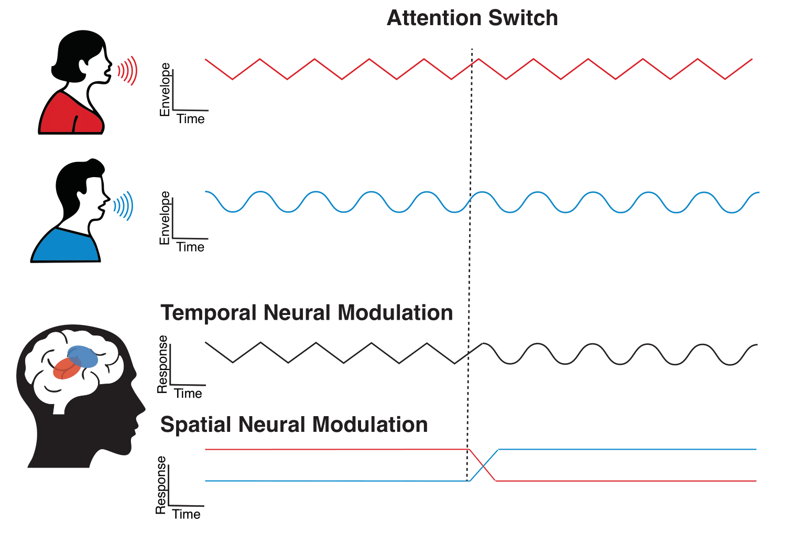
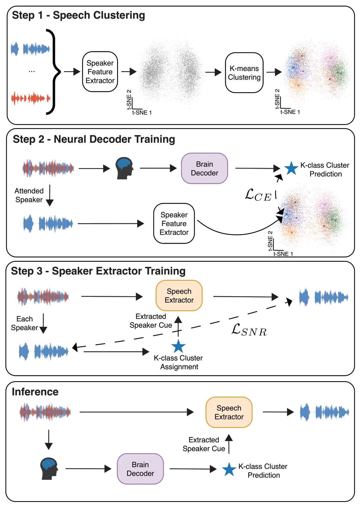

# Speaker Identity is Robustly Encoded in Spatial Patterns of Intracranial EEG for Attention Decoding

  

Conventional Auditory Attention Decoding (AAD) systems rely on the temporal correlation between neural signals and speech envelopes. While effective, this dependence on time-varying correspondence requires long analysis windows to accumulate evidence, limiting the speed and robustness of neuro-steered devices. Here, we introduce a time-invariant framework that decodes attention from spatial patterns of neural activity rather than temporal alignment. Using intracranial EEG (iEEG), we demonstrate that the identity of an attended speaker is reliably reflected in distinct, speaker-specific cortical activation maps. Leveraging these "neural fingerprints", we developed a modular system comprising a brain-to-label classifier and a speaker-conditioned speech extractor. This design allows the speech extractor to be trained on large-scale external corpora without paired neural data. Our system outperforms state-of-the-art temporal models, particularly in short time windows (<2 seconds), and achieves further gains when combined with correlation-based decoders. These findings establish that speaker identity is robustly encoded in spatial neural patterns, offering a complementary, high-speed mechanism for decoding auditory attention.

## Model Overview

  

The model operates through three training stages followed by inference. 
- Step 1 - Speaker Feature Clustering: Speaker embeddings from a large external corpus are clustered to obtain time-invariant speaker centroids. 
- Step 2 - Neural Decoder Training: An LSTM-based model is trained to classify the attended speaker’s cluster label directly from iEEG signals. 
- Step 3 - Speech Extractor Training: A speech extraction model is trained independently on speech mixtures to isolate the target voice conditioned on its cluster centroid. 
- Inference: During testing, the brain predictor infers the attended speaker’s cluster label from neural data, and the corresponding centroid guides the extractor to recover the attended speech from the acoustic mixture.
